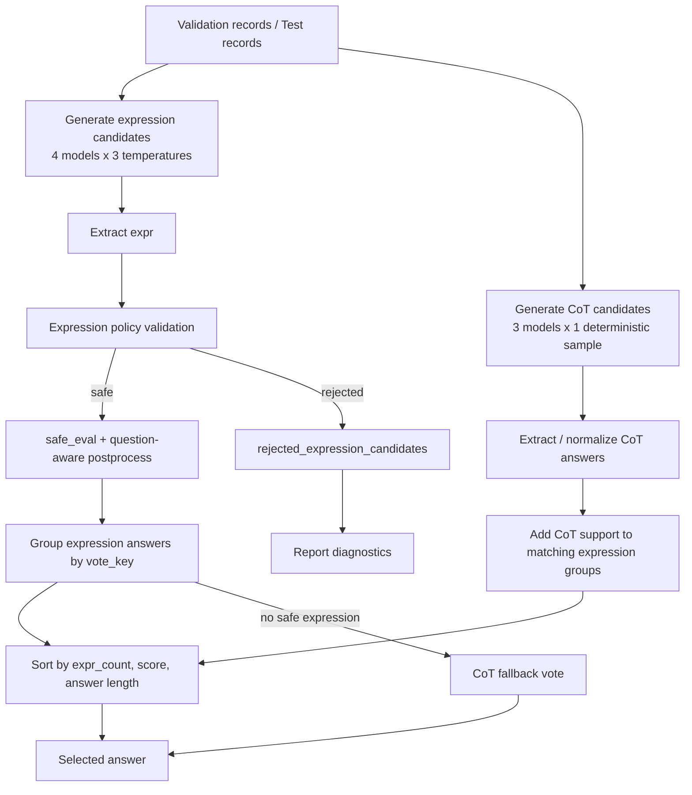

# 投票推理逻辑梳理

本文梳理当前项目中“表达式优先 + CoT 软校准”的投票推理流程。核心入口是 `src/inference/expr4_eval_submit.py`，轻量版表达式优先投票组件是 `src/inference/expression_first_voter.py`。

## 一句话结论

你的理解基本正确：不同模型、不同温度会先生成候选；在 validation split 上搜索一组预设投票策略，选出表现最好的权重与 CoT bonus；最终在 test 上用这个固定策略做多模型投票。

需要补充两点：

1. validation 不是训练一个连续权重模型，而是在有限策略网格中选择最佳策略。
2. 最终投票不是简单“所有模型答案多数投票”，而是表达式候选优先；CoT 只提供软校准和兜底，不覆盖表达式多数。

## 代码入口

| 阶段 | 命令 | 入口 | 主要产物 |
|---|---|---|---|
| 验证选策略 | `bash scripts/evaluate.sh expr4-validate` | `python -m src.inference.expr4_eval_submit validate` | `outputs/evaluation/expr4/selection.json`、`val_report.json` |
| 测试提交 | `bash scripts/submit.sh expr4` | `python -m src.inference.expr4_eval_submit submit` | `outputs/submissions/submit_final.csv`、`expr4_submit_report.json` |

## 候选来源

### 表达式候选

当前使用 4 个表达式模型：

| 模型名 | checkpoint |
|---|---|
| `sft_expr_clean` | `outputs/checkpoints/sft_expr_clean/best` |
| `dpo_expr_clean` | `outputs/checkpoints/dpo_expr_clean/best` |
| `grpo_expr_clean_vllm` | `outputs/checkpoints/grpo_expr_clean_vllm/best` |
| `grpo_expr_from_dpo_clean_vllm` | `outputs/checkpoints/grpo_expr_from_dpo_clean_vllm/best` |

每个表达式模型对每道题使用 3 个温度：

```text
TEMPERATURES = [0.1, 0.3, 0.7]
```

因此每道题最多有：

```text
4 expression models * 3 temperatures = 12 expression candidates
```

其中 `0.1` 是低温确定性生成，`0.3` 和 `0.7` 会开启采样。表达式生成最大长度是 96 token。

### CoT 候选

当前使用 3 个 CoT 模型：

| 模型名 | checkpoint |
|---|---|
| `cot_sft` | `outputs/checkpoints/sft_cot/best` |
| `cot_dpo` | `outputs/checkpoints/dpo/best` |
| `cot_grpo` | `outputs/checkpoints/grpo/best` |

CoT 每个模型每题生成 1 个候选，温度为 0.1，不做多温采样。因此每题最多 3 个 CoT 候选。

## 表达式候选如何变成答案

表达式候选不是直接信任模型输出的 `<answer>`。流程是：

1. 从模型 raw output 提取 `<expr>...</expr>`。
2. 用 `validate_expression()` 做安全检查。
3. 用 `safe_eval_expression()` 计算表达式值。
4. 用 `postprocess_answer()` 根据题意归一最终答案。
5. 归一后生成 `vote_key`，用于和其他候选合并投票。

安全检查会拒绝方程、比较、函数调用、变量、中文、LaTeX、`%`、`//` 等非规范表达式。被拒绝的表达式不参与表达式投票，只记入 `rejected_expression_candidates`。

重要细节：候选生成阶段会保存一个 `answer` 字段，但最终投票阶段会重新从 `expression` 做安全检查和 eval，避免中间产物污染投票。

## CoT 候选如何参与

CoT 候选会从 `<answer>` 中抽取答案，然后按题意归一。它们有两个作用：

1. 当存在安全表达式候选时，CoT 只给表达式答案组增加软支持。
2. 当没有任何安全表达式候选时，CoT 才作为 fallback 做多数投票。

也就是说，CoT 不是和表达式候选完全平权投票。表达式路线是主答案来源。

## Validation 如何决定策略

validation 使用 `data/splits/train_expr_clean_val.json`，当前大小为 1147。

流程：

1. 先为 val 集生成或复用完整候选明细：
   - 表达式：4 模型 * 3 温度。
   - CoT：3 模型 * 1 次生成。
2. 枚举投票策略网格。
3. 每个策略在 val 上完整投票并计算 accuracy。
4. 选择 accuracy 最高的策略。
5. 若 accuracy 相同，优先：
   - fallback 更少；
   - `cot_bonus_scale` 更小。
6. 写入 `outputs/evaluation/expr4/selection.json`。

当前策略网格由两部分组成。

表达式权重 preset：

| preset | `sft_expr_clean` | `dpo_expr_clean` | `grpo_expr_clean_vllm` | `grpo_expr_from_dpo_clean_vllm` |
|---|---:|---:|---:|---:|
| `equal` | 1.0 | 1.0 | 1.0 | 1.0 |
| `rl_boost` | 1.0 | 1.0 | 1.5 | 1.5 |
| `dpo_aware` | 1.0 | 1.2 | 1.4 | 1.6 |

CoT 权重固定：

| CoT 模型 | 权重 |
|---|---:|
| `cot_sft` | 1.0 |
| `cot_dpo` | 1.2 |
| `cot_grpo` | 1.2 |

CoT bonus scale 搜索：

```text
[0.0, 0.15, 0.3, 0.5]
```

因此总共会验证：

```text
3 expression presets * 4 cot bonus scales = 12 strategies
```

当前已经选出的策略是：

```json
{
  "preset": "equal",
  "expr_weights": {
    "sft_expr_clean": 1.0,
    "dpo_expr_clean": 1.0,
    "grpo_expr_clean_vllm": 1.0,
    "grpo_expr_from_dpo_clean_vllm": 1.0
  },
  "cot_weights": {
    "cot_sft": 1.0,
    "cot_dpo": 1.2,
    "cot_grpo": 1.2
  },
  "cot_bonus_scale": 0.15
}
```

对应 val 结果：

```text
accuracy = 0.7619877942458587
correct = 874 / 1147
fallback = 0
source_counts:
  expression_cot_calibrated = 779
  expression_majority = 368
```

## 单题投票排序规则

对每道题，投票函数是 `vote_expr4_soft_calibrated()`。

### 1. 准备安全表达式组

所有安全表达式候选按 `vote_key` 分组。每组统计：

| 字段 | 含义 |
|---|---|
| `expr_count` | 该答案组内安全表达式候选数量 |
| `expr_weight` | 该答案组内表达式模型权重和 |
| `expr_sources` | 支持该答案的表达式候选来源 |
| `cot_support_count` | 归一后支持该答案的 CoT 候选数量 |
| `cot_support_weight` | 支持该答案的 CoT 权重和 |

### 2. 加入 CoT 软支持

对每个表达式答案组，遍历 CoT 候选。如果 CoT 答案与表达式答案按题意归一后等价，则把该 CoT 的权重计入：

```text
cot_support_weight
```

最终组分数为：

```text
score = expr_weight + cot_bonus_scale * cot_support_weight
```

### 3. 选择赢家

排序 key 是：

```python
(
  expr_count,
  expr_weight + cot_bonus_scale * cot_support_weight,
  -len(answer),
)
```

并按降序取第一名。

这意味着：

1. 表达式候选数量优先级最高。
2. CoT bonus 只能在表达式候选数量相同的答案组之间影响第二排序项。
3. 若仍相同，倾向更短的答案字符串。

关键结论：CoT 不能覆盖安全表达式多数。只要某个答案拥有更多安全表达式候选，它会优先胜出。

### 4. source 字段

赢家来源会标记为：

| source | 含义 |
|---|---|
| `expression_majority` | 由表达式候选多数直接胜出 |
| `expression_cot_calibrated` | 胜出答案同时获得 CoT 支持，且 `cot_bonus_scale > 0` |
| `cot_fallback` | 没有任何安全表达式候选，只能用 CoT 投票 |
| `no_candidate` | 表达式和 CoT 都没有可用候选，输出 `0` |

## Fallback 逻辑

Fallback 只在没有安全表达式候选时触发：

1. 若存在 CoT 候选：按 CoT 答案分组，按 `(count, weight)` 降序选择。
2. 若 CoT 也没有候选：输出 `"0"`。

当前 test 提交报告中，8000 题只有 5 题进入 `cot_fallback`。

## Submit 阶段如何复用策略

submit 阶段不会重新在 test 上调权重。它会：

1. 读取 `outputs/evaluation/expr4/selection.json`。
2. 加载 validation 阶段选出的固定策略。
3. 为 test 集生成或复用候选明细。
4. 用固定策略逐题投票。
5. 写出：
   - `outputs/submissions/submit_expr4_voted.csv`
   - `outputs/submissions/submit_final.csv`
   - `outputs/submissions/expr4_submit_report.json`

当前 test 报告：

```text
rows = 8000
source_counts:
  expression_majority = 3356
  expression_cot_calibrated = 4639
  cot_fallback = 5
fallback = 5
```

## 与轻量版 `expression_first_voter.py` 的关系

`src/inference/expression_first_voter.py` 是更简单的表达式优先投票：

1. 安全表达式候选按答案分组。
2. 按 `(count, weight)` 选择表达式赢家。
3. 只有完全打平时，CoT 用来破平。
4. 没有安全表达式时，CoT fallback。

`expr4_eval_submit.py` 是当前提交用的增强版：

1. 固定 4 个表达式模型和 3 个 CoT 模型。
2. 表达式模型多温采样。
3. validation 自动选择策略网格。
4. CoT 支持以 bonus 形式加入第二排序项。
5. 输出完整候选、投票、验证和提交报告。

## 流程图



## 当前需要注意的实验信号

`val_report.json` 中有一个值得复核的现象：`sft_expr_clean` 的 first-candidate 单模型 accuracy 是 `0.7820`，高于当前选中 expr4 策略的 `0.7620`。这不一定说明投票逻辑错了，因为单模型指标和多候选投票指标的风险口径不同；但如果目标是提交最高分，建议后续单独验证：

1. 只用 `sft_expr_clean` 的低温候选提交。
2. 表达式投票时降低或移除弱模型候选。
3. 在策略网格里加入 “SFT-only” 或 “SFT-heavy” preset。
