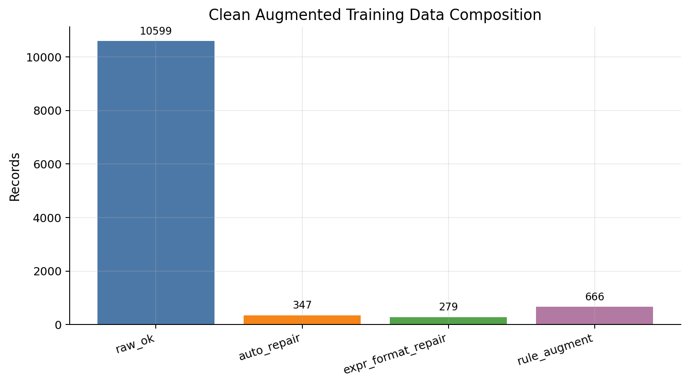
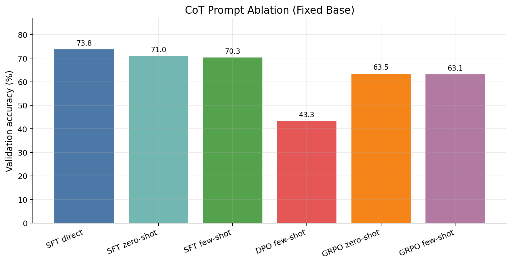
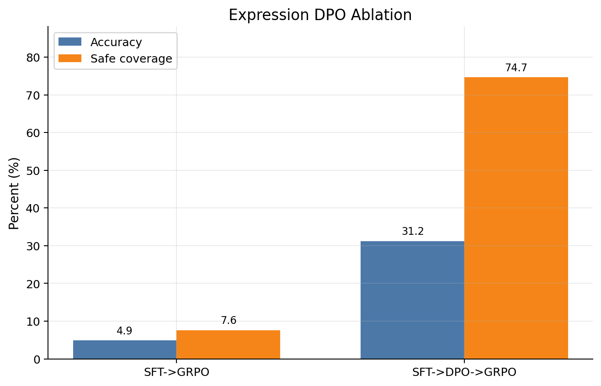
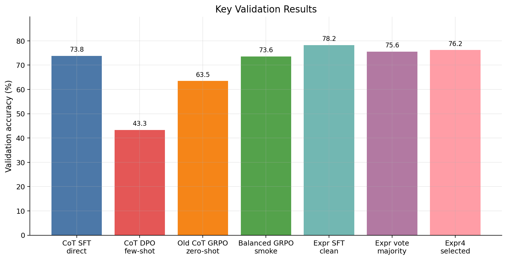
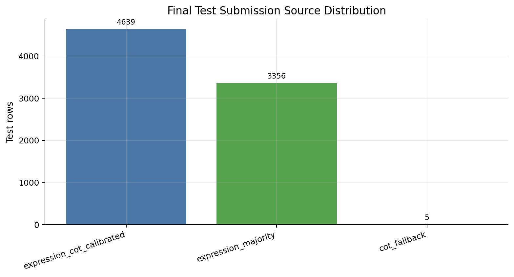

# 小学数学应用题自动解题课程实验报告

报告日期：2026-06-11

## 摘要

本项目面向 CCF BDCI × 题拍拍“小学数学应用题自动解题”任务，目标是在推理阶段仅使用 Qwen2.5-0.5B-Instruct 或更小模型，为小学 1-6 年级数学应用题输出最终数字答案。项目从直接监督微调出发，逐步实现了 CoT 提示工程、CoT SFT、DPO、GRPO、表达式路线、数据质量审计、答案后处理和多模型投票融合。最终形成的工程架构不是单一路线，而是“CoT 推理路线 + 表达式计算路线 + 表达式优先投票”的组合。

实验结果显示，CoT SFT 的 direct prompt 在验证集上达到 0.7376，是 CoT 主线中最稳定的单模型结果；经过 balanced reward 调整后的 CoT GRPO smoke direct 达到 0.7358，接近但尚未稳定超过 SFT。表达式路线表现更强，`sft_expr_clean` 单模型在验证集达到 0.7820，是当前最高的验证单项；最终 `expr4` 融合策略验证准确率为 0.7620，高于 CoT 主线和表达式多数投票，但低于最佳表达式 SFT 单模型。因此，本项目的最终结论是：表达式路线证明了“小模型生成可计算表达式，再由程序计算答案”的有效性；融合策略提高了鲁棒性，但仍需进一步围绕表达式 SFT 主导策略优化。

## 1. 任务约束与项目架构

任务的核心约束有三点。第一，最终推理模型受限于 Qwen2.5-0.5B-Instruct，不允许在测试推理阶段调用更大模型。第二，可以使用 DeepSeek API 辅助构建训练数据，但不能把外部 API 作为最终答案来源。第三，评测以最终答案是否正确为准，测试集没有公开 gold label，因此报告只对验证集报告准确率，对测试集只报告提交产物和来源分布。

项目采用配置驱动的 Python 架构。`configs/` 统一管理 base、SFT、DPO、GRPO、表达式路线和推理配置；`src/data/` 负责 CoT 数据构建、表达式数据构建、质量审计、格式修复、规则增强和 clean 数据合并；`src/training/` 封装 SFT、DPO、GRPO 训练入口；`src/models/` 存放 Qwen/LoRA 加载与奖励函数；`src/inference/` 负责批量推理、答案抽取、题意归一、表达式候选计算和最终投票。`scripts/` 则把各阶段封装为一键运行脚本，便于复现实验。

整体数据流可以概括为：原始训练题进入 CoT 构造和表达式构造；表达式失败、格式不一致、题目歧义等样本进入质量审计与修复；通过安全表达式契约的数据再进入表达式 SFT/DPO/GRPO；CoT 路线和表达式路线分别生成候选答案，最后由表达式优先投票器融合。

## 2. 数据治理与安全表达式契约

原始训练集共有 11999 条，测试集共有 8000 条。直接使用原始数据存在多类风险：题干可能有 OCR 错误、漏符号、标注答案不一致；生成的 CoT 或表达式可能与答案不匹配；部分表达式列式正确，但原始 `eval` 结果没有按照题意转换成百分数、分数、至少/至多取整或保留小数格式。为避免坏数据在 SFT、DPO、GRPO 和增强中被放大，项目实现了数据治理流水线。

最终 clean 合并训练集共 11891 条，其中原始合格数据 10599 条，题意自动修复数据 347 条，表达式结果规范修复数据 279 条，规则增强数据 666 条。增强样本不只检查表达式结果是否等于答案，还要求题干和表达式都能由同一个 `source_id + changed_numbers` 同步替换得到，从而避免“答案碰巧正确但题干不对应”的污染。

表达式路线额外引入安全表达式契约：表达式只能包含数字和纯算术运算，不能包含变量、方程、比较、函数调用、中文单位、LaTeX、条件分支等。模型输出的 `<answer>` 不作为最终依据，系统会重新抽取 `<expr>`，通过安全策略检查后执行 `safe_eval_expression()`，再用题意归一规则转换为最终答案。经过该过滤后，表达式 clean 数据共有 11478 条，划分为 10331 条训练集和 1147 条验证集；表达式 DPO 偏好对共有 9095 对。

这一数据治理环节是后续所有方案的基础。它让报告中的实验结果不只是训练技巧的比较，也反映了“训练数据是否可复验、答案是否可程序验证”的差异。

## 3. Baseline / 直接 SFT

### 实现

Baseline 采用 Qwen2.5-0.5B-Instruct + LoRA SFT，直接学习从题目到数字答案的映射。相关配置集中在 `configs/sft_baseline.yaml` 和 `configs/base.yaml`，训练入口是 `scripts/run_baseline.sh`，推理产物包括 `outputs/submissions/submit_baseline.csv`。该方案的特点是格式最简单，不要求模型输出推理过程或表达式。

### 结果

当前仓库保留了 baseline 提交文件，但没有保留一份可直接复核的独立验证集 accuracy 报告。因此，本报告不补造 baseline 准确率，只把它作为工程起点和提交产物保留情况说明。后续方案的定量比较主要使用 `data/splits/train_expr_clean_val.json` 上已落盘的验证结果。

### 实验分析

直接 SFT 的优点是训练和推理链路短，输出格式容易控制；缺点是小学应用题经常需要多步算术、单位转换、百分数/分数格式化或离散取整，模型直接生成最终数字时容易在中间计算或最终格式上出错。Baseline 因此适合作为最低工程复杂度的对照组，但不足以支撑最终方案。

## 4. 方案 1：CoT Prompt

### 实现

CoT Prompt 方案不微调模型，而是在推理阶段改变 prompt 形态，比较 direct、zero-shot CoT 和 few-shot CoT。实现入口包括 `src/inference/cot_prompting.py`、`src/inference/cot_prompt_ablation.py` 和 `scripts/run_cot_prompt_ablation.sh`。输出通过 `<answer>` 标签优先抽取答案，失败时回退到等号、关键词或末尾数字匹配。

### 结果

fixed-base prompt 消融显示，`sft_cot:direct` 验证准确率为 0.7376，`sft_cot:zero_shot_cot` 为 0.7097，`sft_cot:few_shot_cot` 为 0.7027。DPO 在 few-shot 下达到 0.4333，明显高于其 direct 与 zero-shot，但仍远低于 SFT。GRPO 的 zero-shot 和 few-shot 分别为 0.6347 与 0.6312。

### 实验分析

结果说明 few-shot 并不必然提升小模型数学推理。对 SFT 模型而言，direct prompt 反而最好，few-shot 带来了更长 prompt 和示例偏移，可能压缩了有效解题上下文。对 GRPO 模型而言，few-shot 的 missing answer tag 显著减少，但准确率没有超过 zero-shot，说明格式稳定性和答案正确性并不等价。该方案证明了 prompt 形态需要在目标 checkpoint 上单独验证，不能简单套用“few-shot 一定更强”的经验。

## 5. 方案 2：CoT SFT

### 实现

CoT SFT 使用 DeepSeek API 为训练题生成推理过程和最终答案，再用 Qwen2.5-0.5B-Instruct 进行 LoRA SFT。数据格式统一为 `<think>...</think><answer>...</answer>`，相关入口包括 `src/data/data_builder.py`、`scripts/run_data_build.sh`、`src/training/sft_trainer.py` 和 `scripts/run_sft_cot.sh`。数据构建阶段加入答案匹配、失败重试、分数/百分数抽取、错误推理过滤等逻辑。

### 结果

在当前可复核的验证设置中，CoT SFT 的主要结果体现为 `sft_cot:direct` 的 0.7376，正确 846 / 1147，missing answer tag 为 16。它明显优于 DPO 和旧 GRPO 的主要推理结果，是 CoT 路线里最稳的单模型基线。

### 实验分析

CoT SFT 的有效性来自两方面：一是 DeepSeek 生成的推理步骤让小模型学习到更接近数学解题的中间表达；二是 `<answer>` 标签让答案抽取更可靠。但实验也暴露出小模型 CoT 的局限：推理过程变长后，模型可能生成形式正确但计算错误的链条；同时，最终答案仍由模型直接写出，不能避免“思路对但最后一步算错”的问题。这一问题推动了后续表达式路线的设计。

## 6. 方案 3：DPO

### 实现

DPO 方案使用 chosen/rejected 偏好对进行二阶段偏好优化。CoT 路线中，chosen 是正确推理与正确答案，rejected 是错误推理或错误答案；表达式路线中，chosen 是安全且答案正确的表达式，rejected 是可解析但题意归一后答案错误的表达式。CoT DPO 训练后需要以 SFT-merged base 加载 adapter，否则会出现加载基座不一致的问题。相关入口包括 `src/training/dpo_trainer.py`、`scripts/run_dpo.sh`、`scripts/run_dpo_audit.sh` 和 `src/analysis/dpo_audit.py`。

### 结果

CoT fixed-base 消融中，DPO direct 为 0.2659，zero-shot 为 0.2990，few-shot 为 0.4333。DPO 审计显示 CoT 偏好对总数为 11855，同答案偏好对 430 条，占 3.63%；chosen/rejected 都没有缺失 `<answer>`；rejected 正确而 chosen 错误的记录有 7 条，占 0.06%；截断风险为 0。

### 实验分析

审计结果说明偏好对格式和截断风险并不是主要问题，但 DPO 在 CoT 路线没有带来正向主指标。一个可能原因是 rejected 样本虽然“答案错”，但语言形式仍然像完整推理，模型可能学习到过强的格式或长度偏好；另一个原因是 DPO 二阶段训练可能造成 `<answer>` 格式退化，需要依赖 few-shot 才能恢复部分格式稳定性。DPO 在表达式路线中的作用更明显，见后文表达式 DPO 消融。

## 7. 方案 4：GRPO

### 实现

GRPO 方案使用组相对策略优化，并重新设计了 CoT 五维奖励函数：答案正确性、格式标签、逻辑词、长度正则和无 LaTeX。训练入口为 `src/training/grpo_trainer.py` 和 `scripts/run_grpo.sh`，reward smoke 入口为 `scripts/run_grpo_cot_reward_smoke.sh`。项目还引入 vLLM/fast 加速配置，降低多响应采样带来的训练成本。

### 结果

旧 GRPO 在 fixed-base 消融中的最佳结果是 `grpo:zero_shot_cot` 0.6347。经过 strict/balanced reward smoke 后，strict direct 达到 0.7350，balanced direct 达到 0.7358；balanced 版本正确 844 / 1147，missing answer tag 为 15，已经接近 `sft_cot:direct` 的 0.7376。

### 实验分析

GRPO reward 调整显著恢复了模型性能，说明原始 RL 训练的主要问题不是模型容量不足，而是奖励口径和推理加载链路需要精细控制。但 balanced smoke 仍没有稳定超过 SFT direct，说明 GRPO 在该任务中更像“修复和逼近 SFT”的阶段，而不是确定性的提升阶段。后续如果继续投入，应围绕 reward 权重、答案后处理一致性和中间 checkpoint 选择做更系统的网格实验。

## 8. 表达式路线扩展

### 实现

表达式路线让模型输出 `<expr>...</expr><answer>...</answer>`，但最终答案只信任 `<expr>`。系统从 raw output 中抽取表达式，执行安全策略检查和 `safe_eval_expression()`，再根据题意归一为最终答案。训练数据来自 clean 合并数据中的安全表达式子集，训练流程包括表达式 SFT、表达式 DPO 和表达式 GRPO。相关入口包括 `src/data/expression_training_data.py`、`src/models/reward_expr.py`、`src/training/grpo_expr_trainer.py`、`src/inference/expr_predictor.py`。

表达式 GRPO 使用六维 reward：eval 正确性、可解析性、格式标签、无非法字符、answer 一致性和输出洁净度。与 CoT 路线不同，表达式路线的核心目标不是让模型写更长的推理，而是让模型生成可复验、可计算、可归一的中缀表达式。

### 结果

表达式 clean 数据共有 11478 条，其中训练 10331 条、验证 1147 条。`sft_expr_clean` 在 `expr4` 验证报告中达到 0.7820，正确 897 / 1147，eval success rate 为 1.0，是当前最高的验证单项。表达式 DPO 消融中，SFT->GRPO 准确率为 0.0488，安全覆盖率 0.0761；SFT->DPO->GRPO 准确率提升到 0.3121，安全覆盖率提升到 0.7466。

### 实验分析

表达式 SFT 的成功说明，小模型在“把题意翻译成算术表达式”上比“完整自然语言推理并给出最终数字”更容易形成稳定能力。一旦表达式正确，最终计算由程序完成，可以避免模型最后一步算错。与此同时，表达式 RL 端点仍不稳定：单 GRPO 安全表达式覆盖率过低，DPO->GRPO 虽显著改善覆盖率，但准确率仍远低于表达式 SFT。这说明当前表达式 reward 更擅长把输出拉回可解析区域，还没有稳定提升解题语义能力。表达式路线的主要收益目前来自 SFT，而不是后续 RL。

## 9. 最终融合与提交

### 实现

最终 `expr4` 融合使用 4 个表达式模型和 3 个 CoT 模型。表达式模型包括 `sft_expr_clean`、`dpo_expr_clean`、`grpo_expr_clean_vllm`、`grpo_expr_from_dpo_clean_vllm`，每题使用 0.1、0.3、0.7 三个温度生成候选。CoT 模型包括 `cot_sft`、`cot_dpo`、`cot_grpo`，每题生成一个候选。

融合不是普通平权多数投票，而是表达式优先。所有安全表达式候选先按答案分组，排序时优先考虑安全表达式候选数量，其次是表达式权重加 CoT 软支持分。CoT 只在两个场景中发挥作用：当安全表达式答案组数量相同或权重接近时提供软校准；当没有任何安全表达式候选时作为 fallback。验证阶段在有限策略网格中选择最优 preset，最终选中 equal 表达式权重、CoT 权重 `cot_sft=1.0`、`cot_dpo=1.2`、`cot_grpo=1.2`、`cot_bonus_scale=0.15`。

### 结果

最终选中策略在验证集上准确率为 0.7620，正确 874 / 1147；其中 779 条由 `expression_cot_calibrated` 胜出，368 条由 `expression_majority` 胜出，没有 fallback。纯表达式多数投票为 0.7559。测试集共有 8000 行提交，其中 `expression_cot_calibrated` 4639 条，`expression_majority` 3356 条，`cot_fallback` 5 条。由于测试集没有 gold label，不能报告测试准确率。

### 实验分析

融合策略相较 CoT 主线有明确提升，也比纯表达式多数投票略高，说明 CoT 软校准确实能在部分题目上提供额外支持。但融合结果低于 `sft_expr_clean` 单模型的 0.7820，说明当前策略网格没有充分利用最强表达式 SFT 的优势。一个可能原因是其他表达式 RL 模型虽然能提供多样候选，却也引入了低质量安全表达式，导致多数投票偏离最佳单模型。后续更合理的方向不是盲目增加模型数量，而是以 `sft_expr_clean` 为主权重，使用其他模型只做置信补充或困难题兜底。

## 10. 结果总览

| 方案 | 代表结果 | 说明 |
|---|---:|---|
| Baseline / 直接 SFT | 未保留独立验证准确率 | 保留提交产物，不补造指标 |
| CoT Prompt + CoT SFT | 0.7376 | `sft_cot:direct`，CoT 主线最稳结果 |
| CoT DPO | 0.4333 | `dpo:few_shot_cot`，格式恢复但准确率不足 |
| CoT GRPO balanced smoke | 0.7358 | 接近 SFT direct，但未稳定超过 |
| Expr SFT clean | 0.7820 | 当前最高验证单项 |
| Expr SFT->GRPO | 0.0488 | 安全覆盖不足 |
| Expr SFT->DPO->GRPO | 0.3121 | DPO 显著提升安全覆盖和准确率 |
| Expr majority vote | 0.7559 | 表达式候选多数投票 |
| Expr4 selected fusion | 0.7620 | 最终鲁棒提交策略 |

## 11. 问题、局限与改进方向

第一，部分方案没有统一留存验证指标。Baseline 保留了提交 CSV，但没有保留可复核验证 accuracy，这限制了报告中的直接横向比较。后续应把所有方案统一接入同一验证集评测，并落盘为结构化 JSON。

第二，DPO 和 GRPO 的收益并不稳定。CoT DPO 的偏好数据格式问题较少，但主指标下降明显；表达式 DPO->GRPO 相比单 GRPO 有大幅提升，但仍低于表达式 SFT。说明偏好优化和 RL 需要更细的负样本设计、reward 设计和 checkpoint 选择。

第三，当前最终融合策略不是验证集最优单项。`sft_expr_clean` 单模型高于融合策略，说明融合阶段还需要更细的权重搜索和候选过滤。后续可以尝试表达式 SFT 主导、RL 候选低权重辅助、CoT 只用于无安全表达式时兜底的策略。

第四，表达式路线对题意归一依赖较强。百分数、分数、保留小数、至少/至多取整等规则已经覆盖了大量题型，但仍可能遇到更复杂的中文语义。后续应结合错误分析扩展题型分类器，并把规则触发结果写入验证报告，方便定位格式错误而不是简单统计最终错题。

## 12. 结论

本项目完成了从直接 SFT 到 CoT、DPO、GRPO，再到表达式路线与融合推理的完整实验闭环。最重要的经验是：在 0.5B 小模型约束下，让模型直接完成长链推理和最终计算并不稳定；让模型生成受约束的算术表达式，再由程序执行安全计算和题意归一，是更适合该任务的路线。当前最佳验证单项是 `sft_expr_clean` 的 0.7820，最终融合策略为 0.7620。融合策略虽然不是最高验证单项，但提供了可解释的多候选鲁棒推理框架，并为后续围绕表达式 SFT 主导的投票优化留下了清晰方向。
